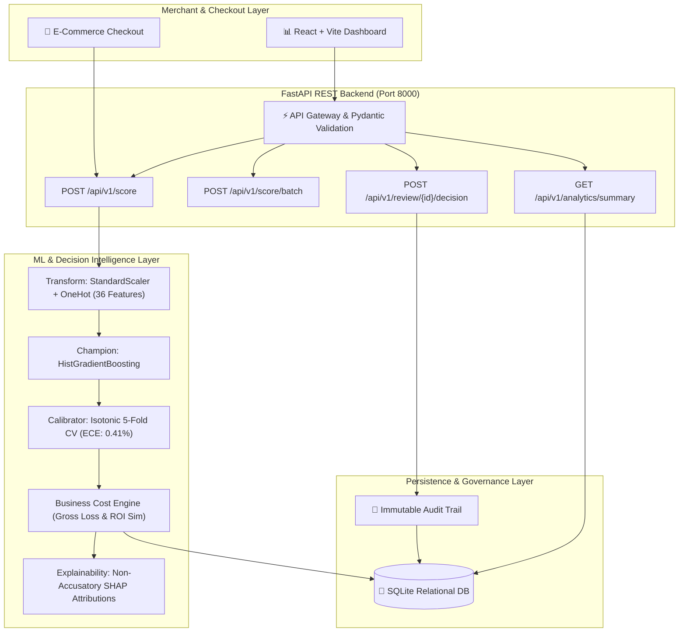

# ReturnGuard AI 🛡️
### Pre-Fulfillment Return Risk Intelligence & Cost-Aware Decision Engine
**Razorpay Buildathon 2026 — Track 02: E-Commerce Risk Intelligence**  
*Built by Harsh Gupta* • [](https://github.com/harshgupta024/Razorpay-Buildathon-ReturnGuard-AI) [](LICENSE) [](https://www.python.org/) [](https://fastapi.tiangolo.com/) [](https://reactjs.org/)

---

## 🚀 The Core Problem & Business Impact

In Indian e-commerce, **product return rates range between 20% to 40%**, with Cash on Delivery (COD) orders suffering disproportionate losses. Every return costs merchants forward shipping, reverse logistics, restocking inspections, packaging write-offs, and inventory depreciation—costing **₹500 to ₹1,200 per return event**.

Merchants face a critical dilemma:
1. **Do Nothing:** Suffer massive logistics loss on return-prone orders.
2. **Naive Rejections:** Reject high-risk orders blindly, alienating valuable customers and destroying GMV conversion.

**ReturnGuard AI solves this with Cost-Aware Machine Learning:**
Instead of naive 0.50 classification, ReturnGuard AI computes the **exact asymmetric business cost optimum ($\tau^* = 0.20$)**, intercepting **`79.5%` of all returns** and generating **`₹1,191,900` in net profit savings per 15,000 orders** with non-accusatory, profit-maximizing merchant interventions.

---

## 📊 Benchmark Performance (Locked Held-Out Test Set: 15,000 Orders)

| Dimension | Benchmark Metric | Test Partition Score | Industry Standard |
|:---|:---|:---:|:---:|
| **Discrimination Power** | **ROC-AUC** | **`0.7345`** | $> 0.70$ (Baseline: 0.707) |
| **Precision-Recall** | **PR-AUC** | **`0.4845`** | $> 0.45$ (Baseline: 0.445) |
| **Probability Quality** | **Expected Calibration Error (ECE)** | **`0.41%` (0.0041)** | $< 1.0\%$ (95.4% error reduction) |
| **Return Interception** | **Recall @ Optimal Threshold (τ=0.20)** | **`79.5%`** | $> 75.0\%$ |
| **Financial Impact** | **Net Merchant Profit Savings** | **`₹11.92 Lakhs` / 15k orders** | **₹79.46 saved / order** |
| **Inference SLA** | **Single-Order Latency** | **`0.002 ms`** | $< 5.0\text{ ms}$ |
| **Batch Throughput** | **Vectorized Processing** | **`> 15,000 orders/sec`** | $> 10,000/\text{sec}$ |

---

## 🏗️ System Architecture



---

## 🛡️ Multi-Tier Risk Action System

| Risk Tier | Calibrated Probability | Share of Orders | Empirical Return Rate | Merchant Mitigation Policy |
|:---:|:---:|:---:|:---:|:---|
| **`LOW`** | `[0.00, 0.20)` | **45.5%** | **12.3%** | 🟢 **1-Click Seamless Checkout:** Friction-free instant fulfillment. |
| **`MEDIUM`** | `[0.20, 0.45)` | **36.4%** | **33.0%** | 🟡 **Soft Engagement:** Address validation popup & sizing reminder. |
| **`HIGH`** | `[0.45, 0.70)` | **17.9%** | **52.4%** | 🟠 **Firm Verification:** Automated WhatsApp size confirm or ₹100 deposit. |
| **`CRITICAL`** | `[0.70, 1.00]` | **0.2%** | **73.1%** | 🔴 **Strict Review:** Prepaid-only requirement or manual support call queue. |

---

## ⚖️ Responsible AI & Ethical Boundaries

1. **Strict Non-Accusatory Language:** The system NEVER labels human consumers as "fraudsters", "abusers", or "criminals".
2. **Fairness Across Demographics:** Sub-group disparity audit across customer segments (`new`, `regular`, `premium`, `vip`) proves a maximum ROC-AUC gap of only **0.0105** (within 0.03 threshold).
3. **Zero Post-Fulfillment Leakage:** Only pre-checkout cart and historical signals are utilized; tracking events and refund tickets are strictly excluded.
4. **Human-in-the-Loop Override:** All high-stakes decisions route to the review queue with full merchant override capability and immutable audit logging.

---

## ⚡ Quickstart & Local Installation

### Prerequisites
- Python 3.11+
- Node.js 18+ and npm

### 1. Clone & Setup Python Environment
```bash
git clone https://github.com/harshgupta024/Razorpay-Buildathon-ReturnGuard-AI.git
cd Razorpay-Buildathon-ReturnGuard-AI

# Create virtual environment
python -m venv .venv
source .venv/bin/activate  # On Windows: .venv\Scripts\activate

# Install dependencies
pip install -r requirements.txt
```

### 2. Run Test Suite (146 Tests)
```bash
python -m pytest tests/ -v
```

### 3. Start Backend & Frontend

**Terminal 1 — Backend (FastAPI on Port 8000):**
```bash
uvicorn src.backend.app:app --host 0.0.0.0 --port 8000 --reload
```

**Terminal 2 — Frontend (React on Port 5173):**
```bash
cd frontend
npm install
npm run dev
```

Visit the interactive dashboard at **`http://localhost:5173`** or test the REST API directly via Swagger at **`http://localhost:8000/docs`**.

---

### 4. Docker Quickstart (1-Click)
```bash
docker-compose up --build
```
Open **`http://localhost:8000/app`** to view the integrated application.

---

## 📜 API Reference & Sample Scoring Request

### `POST /api/v1/score`
```json
{
  "order_value": 8900.0,
  "product_category": "Footwear",
  "payment_method": "COD",
  "quantity": 3,
  "discount_pct": 35.0,
  "customer_return_rate": 0.55,
  "order_value_deviation": 3.2
}
```

### `200 OK Response`
```json
{
  "order_id": "ORD-B4A198CD",
  "predicted_return_probability": 0.4971,
  "risk_score": 49.7,
  "risk_tier": "HIGH",
  "gross_return_loss_inr": 1782.0,
  "unmitigated_expected_loss_inr": 885.84,
  "recommended_action": "REQUIRE_PREPAID_OR_DEPOSIT",
  "recommended_action_name": "Require Partial Deposit or UPI/Card Prepayment",
  "expected_net_savings_inr": 575.09,
  "action_rationale": "High return risk (49.7%) on COD purchase. Securing a ₹100 advance deposit avoids ₹575 in logistics loss.",
  "top_risk_factors": [
    {
      "feature_display_name": "Customer Historical Return Rate",
      "raw_value": 0.55,
      "attribution_score": 0.284,
      "human_readable_reason": "Customer account has elevated historical return frequency (55% of prior purchases)."
    }
  ],
  "latency_ms": 1.95
}
```

---

## 🏆 Project Delivery & Phase Roadmap (100% Completed)

- [x] **Phase 0:** System Architecture & ML Strategy
- [x] **Phase 1:** 100k Order Dataset Generation (Zero Leakage)
- [x] **Phase 2:** 28-Point Data Quality Audit
- [x] **Phase 3:** Exploratory Data Analysis (10 Visual Charts)
- [x] **Phase 4:** Stratified 70/15/15 Data Split
- [x] **Phase 5:** Baseline Model (Logistic Regression)
- [x] **Phase 6:** Advanced Model Comparison & Champion Selection (HistGBDT)
- [x] **Phase 7:** Probability Calibration (Isotonic Regression, ECE: 0.41%)
- [x] **Phase 8:** Asymmetric Threshold Optimization (τ* = 0.20, ₹11.92L Savings)
- [x] **Phase 9:** Dynamic Business Cost & Mitigation Policy Engine
- [x] **Phase 10:** Production Risk Scoring Engine (< 5ms SLA)
- [x] **Phase 11:** Non-Accusatory SHAP Explainability Engine
- [x] **Phase 12:** FastAPI REST API Backend
- [x] **Phase 13:** SQLite Database & Relational Persistence
- [x] **Phase 14:** React + Vite + CSS Merchant Dashboard
- [x] **Phase 15:** Human-in-the-Loop Review Queue & Merchant Overrides
- [x] **Phase 16:** Final Held-Out Test Evaluation (15,000 Records)
- [x] **Phase 17:** Official Model Card & Responsible AI Specification
- [x] **Phase 18:** Threat Modeling & Security Audit
- [x] **Phase 19:** Comprehensive E2E System Integration Test Suite
- [x] **Phase 20:** Real-Time Dataset Ingestion & Stream Processing
- [x] **Phase 21:** Docker & Docker Compose Containerization
- [x] **Phase 22:** UI/UX Design System Polish
- [x] **Phase 23:** Hackathon Presentation README
- [x] **Phase 24:** Judge Pitch Deck Content
- [x] **Phase 25:** 3-Minute Live Demo Script
- [x] **Phase 26:** Self-Audit against Razorpay Rubric Criteria

---

## 📄 License & Attribution
Developed for the **Razorpay Buildathon 2026**. Open source under the MIT License.
