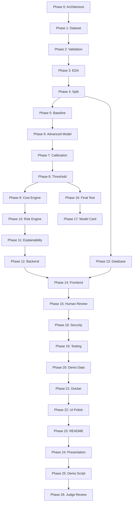

# Development Plan — ReturnGuard AI

## Phase Overview

| Phase | Name | Description | Status |
|-------|------|-------------|--------|
| 0 | Project Discovery & Architecture | Workspace inspection, documentation, architecture | ✅ Complete |
| 1 | Dataset Discovery & Acquisition | Find, evaluate, download public dataset | 🔲 Pending |
| 2 | Data Validation | Build validation pipeline, quality report | 🔲 Pending |
| 3 | Exploratory Data Analysis | EDA, charts, patterns, leakage check | 🔲 Pending |
| 4 | Train/Validation/Test Split | Stratified split with leakage safeguards | 🔲 Pending |
| 5 | Baseline Model | Logistic Regression + evaluation pipeline | 🔲 Pending |
| 6 | Advanced Model | XGBoost/LightGBM comparison | 🔲 Pending |
| 7 | Probability Calibration | Verify/improve probability estimates | 🔲 Pending |
| 8 | Threshold Optimization | Business-aware threshold selection | 🔲 Pending |
| 9 | Business Cost Engine | Configurable FP/FN cost model | 🔲 Pending |
| 10 | Risk Scoring Engine | Production inference pipeline | 🔲 Pending |
| 11 | Explainability | SHAP-based risk factor explanations | 🔲 Pending |
| 12 | FastAPI Backend | REST API with real ML model | 🔲 Pending |
| 13 | Database | SQLite schema, SQLAlchemy models | 🔲 Pending |
| 14 | Frontend | React dashboard with Tailwind + Recharts | 🔲 Pending |
| 15 | Human-in-the-Loop Review | Override capability and audit trail | 🔲 Pending |
| 16 | Final Held-Out Test | One-time evaluation on test set | 🔲 Pending |
| 17 | Model Card | Responsible AI documentation | 🔲 Pending |
| 18 | Security Review | Input validation, CORS, secrets, logging | 🔲 Pending |
| 19 | Testing | Unit, integration, end-to-end tests | 🔲 Pending |
| 20 | Demo Data | Curated demo cases for presentation | 🔲 Pending |
| 21 | Docker | Containerized deployment | 🔲 Pending |
| 22 | UI Polish | Final UX improvements | 🔲 Pending |
| 23 | Hackathon README | Polished submission README | 🔲 Pending |
| 24 | Presentation | Slide deck content | 🔲 Pending |
| 25 | Final Demo Script | 3-5 minute walkthrough | 🔲 Pending |
| 26 | Final Judge Review | Self-evaluation and fixes | 🔲 Pending |

## Phase Dependencies

## Estimated Effort Per Phase

| Phase | Estimated Complexity | Key Outputs |
|-------|---------------------|-------------|
| 0 | Low | Documentation, architecture |
| 1 | Medium | Dataset, download script, provenance |
| 2 | Low | Validation pipeline, quality report |
| 3 | Medium | EDA report, visualizations |
| 4 | Low | Split script, leakage checks |
| 5 | Medium | Baseline model, evaluation pipeline |
| 6 | Medium | Model comparison, experiment table |
| 7 | Low | Calibration analysis |
| 8 | Medium | Threshold analysis, business tradeoff |
| 9 | Medium | Cost engine with configurable params |
| 10 | Medium | Production risk scoring pipeline |
| 11 | Medium | SHAP integration, explanation engine |
| 12 | High | Full REST API with tests |
| 13 | Medium | Database schema, ORM models |
| 14 | High | Complete React dashboard |
| 15 | Medium | Review workflow, audit trail |
| 16 | Low | Final test evaluation report |
| 17 | Low | Model card documentation |
| 18 | Medium | Security audit and fixes |
| 19 | High | Comprehensive test suite |
| 20 | Low | Curated demo scenarios |
| 21 | Medium | Docker configuration |
| 22 | Medium | UI/UX polish pass |
| 23 | Low | Polished README |
| 24 | Low | Presentation content |
| 25 | Low | Demo script |
| 26 | Medium | Self-evaluation, fixes |

## Phase Completion Checklist Template

After each phase:

- [ ] Implementation explained
- [ ] Files created / modified listed
- [ ] Tests run and passing
- [ ] Test results shown
- [ ] Project tree shown
- [ ] Run commands provided
- [ ] Known issues listed
- [ ] Next phase explained
- [ ] **STOP and wait for approval**
