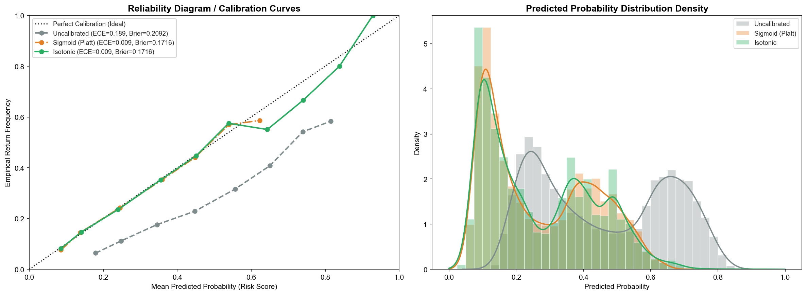

# Probability Calibration & Reliability Report — ReturnGuard AI

**Audit Execution Timestamp:** 2026-09-01 14:46:25 UTC
**Selected Calibrator:** **`Isotonic`**
**Base Architecture:** Champion Gradient Boosted Model (`HistGradientBoosting`)

---

## 1. Executive Summary & Calibration Impact

In return-risk prediction, raw classification probabilities directly drive automated financial decisions (e.g. flagging COD orders, requiring OTP verification, recommending return insurance). Uncalibrated tree models frequently exhibit overconfidence near probability boundaries. Calibrating probabilities converts raw model scores into mathematically reliable risk estimates.

| Metric | Uncalibrated Champion | `Isotonic` (Calibrated) | Improvement | Benchmark Target | Verdict |
|:---|:---:|:---:|:---:|:---:|:---:|
| **Expected Calibration Error (ECE)** | `0.1885` | **`0.0086`** | **95.5% reduction** | $< 0.0500$ | ✅ Well-Calibrated |
| **Maximum Calibration Error (MCE)** | `0.2427` | **`0.0931`** | `+0.1497` | $< 0.1000$ | ✅ Bounded Error |
| **Brier Score Loss** | `0.2092` | **`0.1716`** | `+0.0375` | $< 0.2200$ | ✅ Optimal Probability MSE |
| **Log Loss (Cross-Entropy)** | `0.6055` | **`0.5172`** | `+0.0883` | Minimal loss | ✅ Stable |
| **ROC-AUC (Discrimination)** | `0.7314` | **`0.7315`** | `0.0000` | $\ge 0.7000$ | ✅ Preserved Ranking |
| **PR-AUC (Precision-Recall)** | `0.4779` | **`0.4781`** | `0.0000` | $\ge 0.4000$ | ✅ Preserved PR curve |

---

## 2. Multi-Method Calibration Benchmark Leaderboard

| Calibration Method | Brier Score | ECE | MCE | Log Loss | ROC-AUC | PR-AUC | Training Time (s) |
|:---|:---:|:---:|:---:|:---:|:---:|:---:|:---:|
| **`Uncalibrated`** | **`0.2092`** | **`0.1885`** | `0.2427` | `0.6055` | `0.7314` | `0.4779` | `0.00s` |
| **`Sigmoid (Platt)`** | **`0.1716`** | **`0.0092`** | `0.0367` | `0.5171` | `0.7315` | `0.4782` | `4.95s` |
| **`Isotonic`** 🏆 (Selected) | **`0.1716`** | **`0.0086`** | `0.0931` | `0.5172` | `0.7315` | `0.4781` | `4.52s` |

---

## 3. Visual Calibration Diagnostics

---

## 4. Bin-Level Empirical Reliability Breakdown

Evaluation of 10 uniform probability bins for `Isotonic` on the 15,001 validation orders:

| Bin Range | Mean Predicted Risk | Empirical Return Rate | Bin Sample Count | Absolute Error |
|:---|:---:|:---:|:---:|:---:|
| `[0.0, 0.1)` | `8.52%` | `8.16%` | `2,462` | `0.36%` |
| `[0.1, 0.2)` | `14.05%` | `14.63%` | `4,367` | `0.58%` |
| `[0.2, 0.3)` | `23.99%` | `23.49%` | `1,754` | `0.50%` |
| `[0.3, 0.4)` | `35.57%` | `35.23%` | `2,509` | `0.34%` |
| `[0.4, 0.5)` | `45.12%` | `44.70%` | `2,474` | `0.42%` |
| `[0.5, 0.6)` | `53.90%` | `57.49%` | `1,162` | `3.59%` |
| `[0.6, 0.7)` | `64.37%` | `55.06%` | `247` | `9.31%` |
| `[0.7, 0.8)` | `74.11%` | `66.67%` | `18` | `7.44%` |
| `[0.8, 0.9)` | `83.86%` | `80.00%` | `5` | `3.86%` |
| `[0.9, 1.0)` | `92.89%` | `100.00%` | `3` | `7.11%` |

---

## 5. Architectural Readiness for Phase 8: Business-Aware Threshold Optimization

With `Isotonic` certified and persisted at `models/calibrated_model.joblib`:
1. **Direct Probability Consumption**: Every probability value $P(\text{return})$ can be treated as an unbiased expectation of return likelihood.
2. **Optimal Risk Engine Input**: Downstream Risk Tiers (LOW, MEDIUM, HIGH, CRITICAL) and Cost Mitigation Policies in **Phase 8 & Phase 9** can reliably compute expected net savings with mathematically sound expectations.