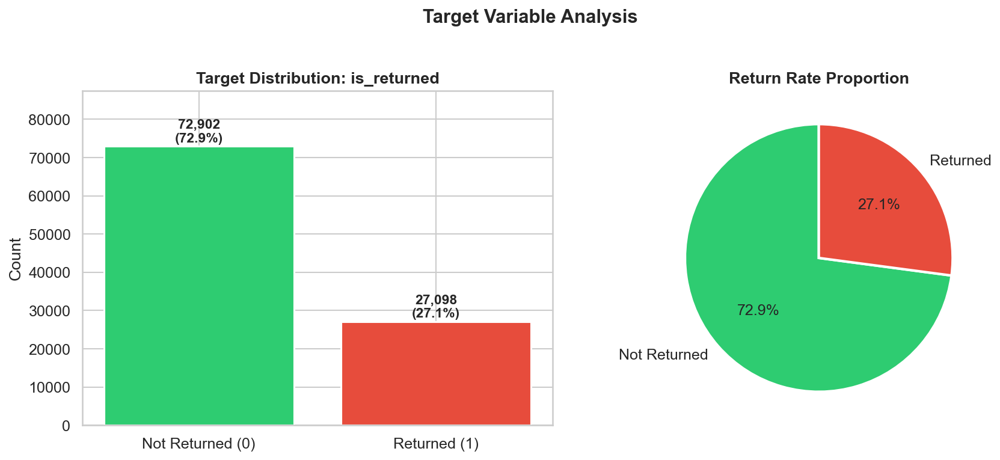
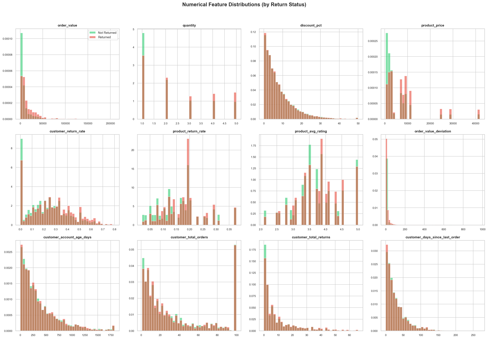
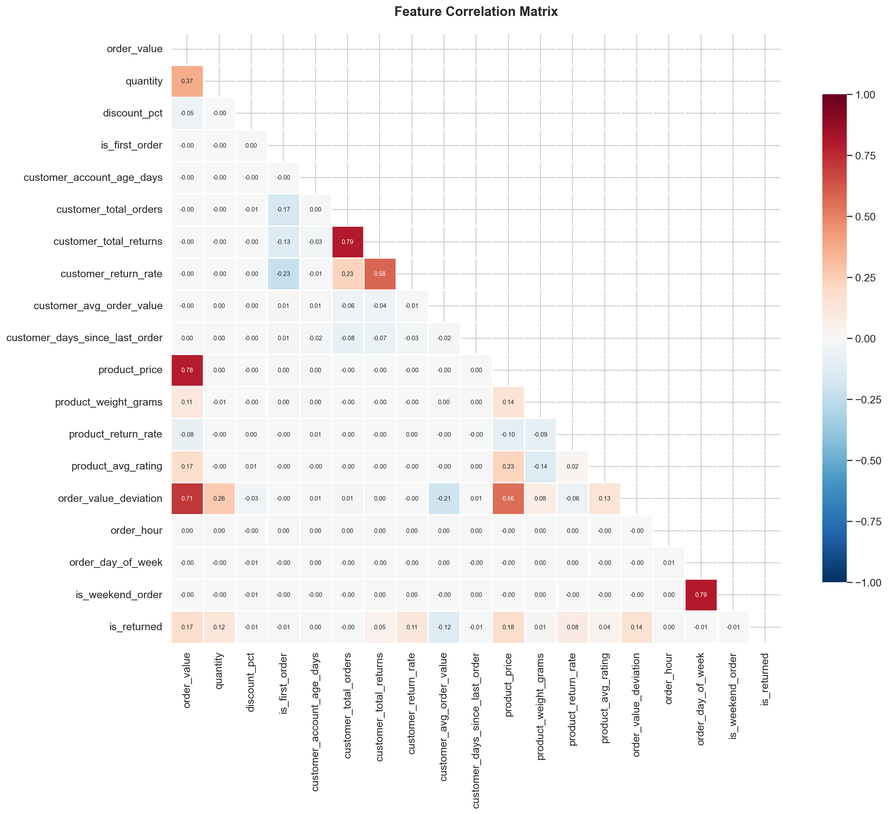
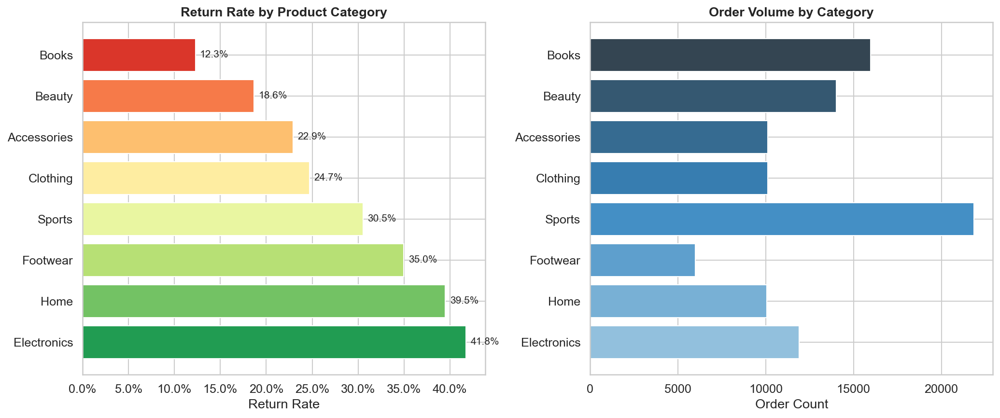
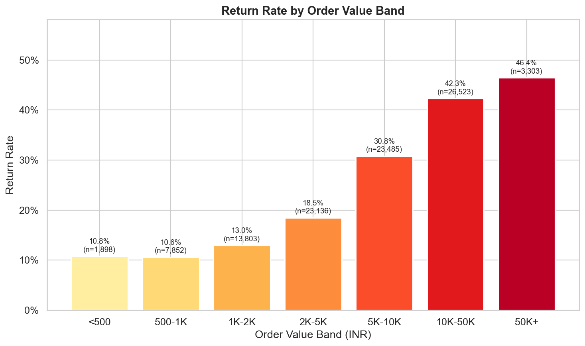
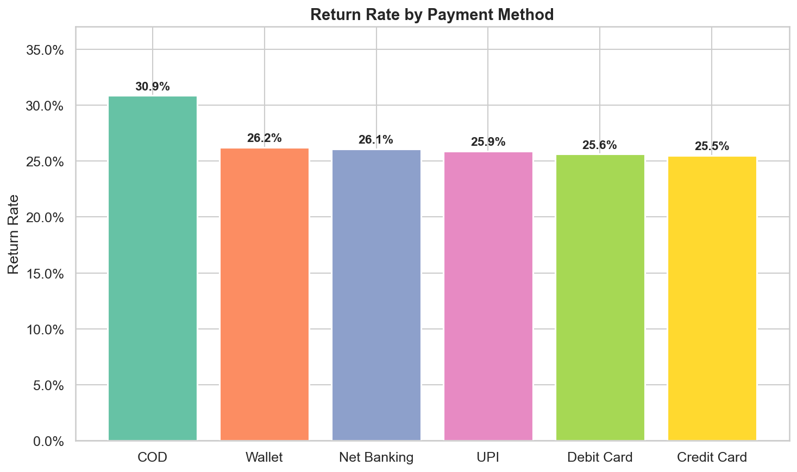
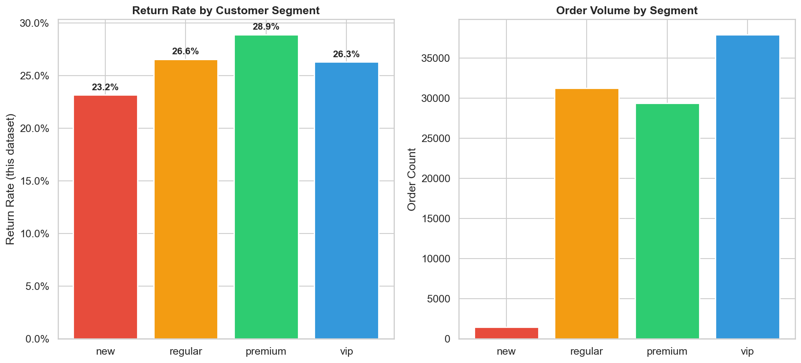
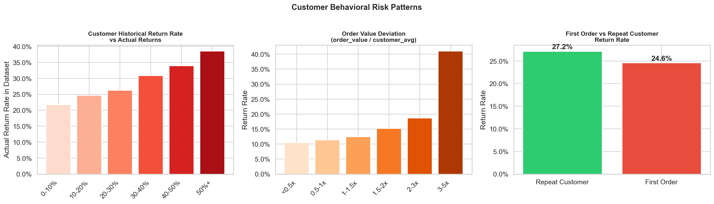
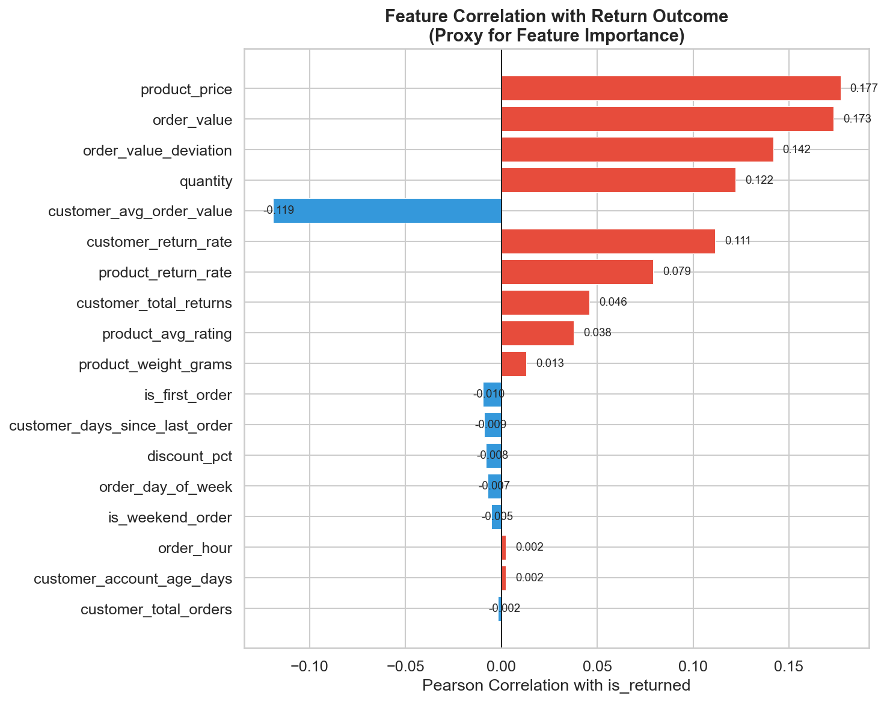
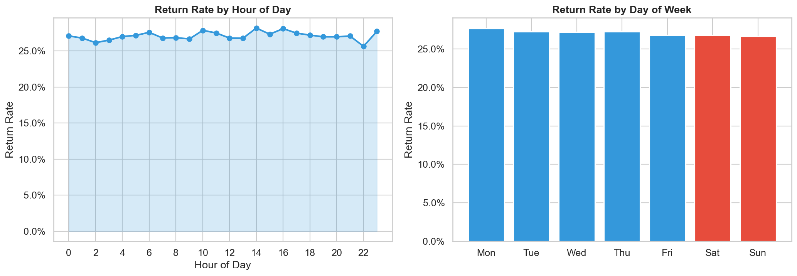

# Exploratory Data Analysis Report --- ReturnGuard AI

**Generated:** 2026-08-28 22:18
**Dataset:** `data/raw/ecommerce_orders.csv`
**Records:** 100,000 orders | **Features:** 26 columns

---

## 1. Target Distribution

| Metric | Value |
|--------|-------|
| Return Rate | **27.10%** |
| Not Returned | 72,902 |
| Returned | 27,098 |
| Imbalance Ratio | 1:2.69 |

The dataset has a **27.1% return rate** --- moderately imbalanced. This is realistic for e-commerce
(typical range: 15-35%). Accuracy alone will be insufficient; we need PR-AUC and F1.

## 2. Numerical Feature Distributions

### Outlier Summary (IQR Method)

| Feature | Outliers | Outlier % | IQR Lower | IQR Upper |
|---------|----------|-----------|-----------|-----------|
| `order_value_deviation` | 10,988 | 11.0% | -9.42 | 18.59 |
| `order_value` | 10,869 | 10.9% | -13367.88 | 27853.12 |
| `customer_total_returns` | 9,209 | 9.2% | -15.50 | 28.50 |
| `product_price` | 6,019 | 6.0% | -8408.50 | 17867.50 |
| `customer_account_age_days` | 4,982 | 5.0% | -506.50 | 1121.50 |
| `customer_days_since_last_order` | 4,817 | 4.8% | -41.50 | 90.50 |
| `discount_pct` | 4,669 | 4.7% | -10.90 | 24.30 |
| `product_return_rate` | 4,052 | 4.0% | -0.03 | 0.33 |
| `product_avg_rating` | 2,037 | 2.0% | 2.35 | 5.15 |
| `customer_return_rate` | 338 | 0.3% | -0.27 | 0.71 |
| `quantity` | 0 | 0.0% | -2.00 | 6.00 |
| `customer_total_orders` | 0 | 0.0% | -59.50 | 120.50 |

**Key observations:**
- `order_value_deviation` has the most outliers --- orders significantly above customer average
- `customer_total_orders` and `customer_total_returns` have right-skewed distributions (power law)
- Outliers are genuine data points (not errors), so we retain them for modeling

## 3. Feature Correlations

### Top Correlations with Target (`is_returned`)

| Feature | Correlation | Direction |
|---------|-------------|-----------|
| `product_price` | 0.1769 | Increases return risk |
| `order_value` | 0.1734 | Increases return risk |
| `order_value_deviation` | 0.1418 | Increases return risk |
| `quantity` | 0.1221 | Increases return risk |
| `customer_avg_order_value` | -0.1193 | Decreases return risk |
| `customer_return_rate` | 0.1115 | Increases return risk |
| `product_return_rate` | 0.0791 | Increases return risk |
| `customer_total_returns` | 0.0459 | Increases return risk |
| `product_avg_rating` | 0.0378 | Increases return risk |
| `product_weight_grams` | 0.0131 | Increases return risk |
| `is_first_order` | -0.0097 | Decreases return risk |
| `customer_days_since_last_order` | -0.0090 | Decreases return risk |
| `discount_pct` | -0.0080 | Decreases return risk |
| `order_day_of_week` | -0.0070 | Decreases return risk |
| `is_weekend_order` | -0.0053 | Decreases return risk |
| `order_hour` | 0.0023 | Increases return risk |
| `customer_account_age_days` | 0.0023 | Increases return risk |
| `customer_total_orders` | -0.0018 | Decreases return risk |

**Key finding:** `customer_return_rate` and `product_return_rate` are the strongest predictors
of return risk. This is consistent with the hypothesis that past behavior is the best predictor.

## 4. Return Rate by Product Category

| Category | Order Count | Return Rate | Avg Order Value |
|----------|-------------|-------------|-----------------|
| Electronics | 11,910 | 41.8% | Rs.42,494 |
| Home | 10,050 | 39.5% | Rs.19,242 |
| Footwear | 5,988 | 35.0% | Rs.11,866 |
| Sports | 21,842 | 30.5% | Rs.10,984 |
| Clothing | 10,123 | 24.7% | Rs.4,503 |
| Accessories | 10,109 | 22.9% | Rs.4,897 |
| Beauty | 14,007 | 18.6% | Rs.3,646 |
| Books | 15,971 | 12.3% | Rs.1,516 |

**Clothing and Footwear** have the highest return rates, consistent with real-world e-commerce
patterns (sizing issues, fit, and appearance expectations drive higher returns).

## 5. Return Rate by Order Value Band

## 6. Return Rate by Payment Method

**COD (Cash on Delivery)** has the highest return rate, which aligns with industry knowledge:
COD orders have lower purchase commitment and higher return propensity.

## 7. Return Rate by Customer Segment

## 8. Customer Behavioral Risk Patterns

### Key Behavioral Insights

- **First order return rate:** 24.6% vs repeat customers: 27.2%
- Higher customer historical return rate strongly predicts future returns
- Orders significantly above customer average value show elevated return risk

## 9. Feature Importance (Correlation Proxy)

## 10. Temporal Patterns

Return rates are relatively stable across hours and days, suggesting time-of-order
is a weak predictor. This is expected given the data generation process.

---

## 11. Summary of Key EDA Findings

| # | Finding | Implication for Modeling |
|---|---------|------------------------|
| 1 | Return rate is 27.1% (moderately imbalanced) | Use PR-AUC and F1, not just accuracy |
| 2 | `customer_return_rate` is the strongest predictor | Include customer history features prominently |
| 3 | `product_return_rate` is the second strongest | Product-level risk matters significantly |
| 4 | COD has highest return rate among payment methods | Payment method is a useful feature |
| 5 | Clothing/Footwear have highest category returns | Category is an informative feature |
| 6 | Order value deviation increases return risk | Unusual order sizes signal risk |
| 7 | First orders have slightly higher return rates | is_first_order is a mild risk signal |
| 8 | Temporal features (hour, day) are weak predictors | Include but don't expect high importance |
| 9 | No single feature has extreme correlation (>0.85) | No obvious leakage detected |
| 10 | Outliers are genuine, not errors | Retain outliers for tree-based models |

## 12. Limitations and Biases

1. **Synthetic data**: Patterns are generated, not organically observed. Real-world data may have
   more complex, non-linear interactions and additional noise sources.
2. **No seasonality**: The synthetic data lacks seasonal patterns (holiday spikes, etc.)
3. **Fixed product catalog**: Only 50 products vs. thousands in real e-commerce
4. **No geographic features**: Location is not included as a feature
5. **Feature correlations are designed**: The logistic risk model creates predictable correlations

> **IMPORTANT:** The held-out test set was NOT used for any feature selection decisions in this EDA.