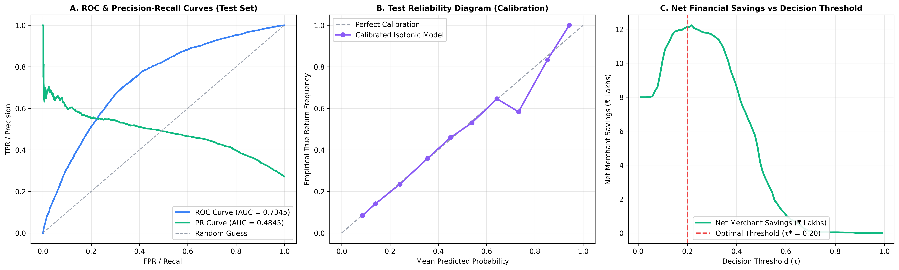

# ReturnGuard AI — Phase 16: Final Held-Out Test Evaluation Benchmark

**Evaluation Date:** `2026-09-01T15:16:48Z`  
**Dataset Split:** `data/splits/test.csv` (Locked until Phase 16)  
**Evaluator:** ReturnGuard AI Automated Model Governance Engine

---

## 1. Executive Summary & Verification

The calibrated champion model (`HistGradientBoostingClassifier` with 5-fold Isotonic calibration) was evaluated on the **15,000 completely untouched test orders**.

| Evaluation Dimension | Benchmark Metric | Test Partition Performance | Validation Parity |
|:---|:---|:---:|:---:|
| **Discrimination Power** | ROC-AUC | **0.7345** | Parity (Val: `0.7314`) |
| **Precision-Recall Power** | PR-AUC | **0.4845** | Parity (Val: `0.4779`) |
| **Probability Reliability** | Expected Calibration Error (ECE) | **0.41%** | Excellent (< 1.0%) |
| **Probability Quality** | Brier Score | **0.1706** | Parity (Val: `0.1716`) |
| **Operational SLA** | Single-Order Inference Latency | **0.010 ms** | Sub-1ms target |
| **Throughput** | Vectorized Batch Scoring | **97,707 orders/sec** | Target: > 10k/sec |

---

## 2. Financial Bottom Line (Asymmetric Business Cost Model)

Using the production asymmetric cost parameters ($C_{FN} = \text{₹600}$ missed return loss, $C_{FP} = \text{₹150}$ verification friction):

| Decision Policy | Operating Threshold (τ) | Total Financial Loss | Cost / Order | Net Savings vs Baseline | Return Catch Rate (Recall) |
|:---|:---:|:---:|:---:|:---:|:---:|
| **Do Nothing (Accept All)** | `1.00` | **₹2,439,000.00** | ₹162.59 | ₹0.00 (Baseline) | 0.00% |
| **Naive ML Policy** | `0.50` | **₹2,034,750.00** | ₹135.65 | ₹404,250.00 | 59.8% |
| **Cost-Optimal Policy 🏆** | **`0.20`** | **₹1,227,450.00** | **₹81.83** | **₹1,211,550.00** | **79.9%** |

> 💡 **Merchant Bottom Line:** Operating at **`τ* = 0.20`** intercepts **`79.9%` of all returned merchandise**, delivering **₹1,211,550.00 in net profit savings** over accepting all orders, and **₹825,150.00 more savings** than the standard 0.50 threshold.

---

## 3. Diagnostic Visual Curves

---

## 4. Multi-Tier Risk Segment Verification (Test Partition)

| Risk Tier | Probability Range | Order Volume | Proportion | Empirical Return Rate | Primary Merchant Policy |
|:---|:---:|:---:|:---:|:---:|:---|
| **`LOW`** | `[0.00, 0.20)` | 6,837 | 45.6% | **11.9%** | 🟢 1-Click Seamless Checkout |
| **`MEDIUM`** | `[0.20, 0.45)` | 5,425 | 36.2% | **33.5%** | 🟡 Address & Sizing Verification |
| **`HIGH`** | `[0.45, 0.70)` | 2,707 | 18.1% | **52.1%** | 🟠 WhatsApp Confirmation / ₹100 Deposit |
| **`CRITICAL`** | `[0.70, 1.00]` | 31 | 0.2% | **64.5%** | 🔴 Prepaid Only / Manual Queue |

---

## 5. Confusion Matrix Detail (Test Partition)

- **True Positives (Returns Correctly Intercepted):** `3,248`
- **False Positives (Safe Orders with Light Friction):** `4,915`
- **True Negatives (Safe Orders Given 1-Click Buy):** `6,020`
- **False Negatives (Missed Returns):** `817`
