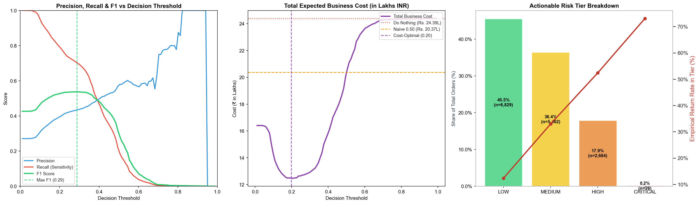

# Business-Aware Threshold Optimization & Risk Tier Report — ReturnGuard AI

**Optimization Execution Timestamp:** 2026-09-01 14:49:22 UTC
**Evaluated Partition:** Validation Split (15,001 orders | 4,065 returned)
**Cost Model Parameters:** Missed Return Cost ($C_{FN}$) = Rs. 600, Friction Cost ($C_{FP}$) = Rs. 150

---

## 1. Executive Summary & Cost-Optimal Threshold

Standard classification pipelines default to an uncalibrated 0.50 decision boundary. In e-commerce returns, missing a return is **4.0x more expensive** than adding verification friction. ReturnGuard AI determines the mathematically optimal threshold minimizing net merchant loss.

| Decision Policy | Decision Threshold | Total Validation Loss | Average Cost / Order | Net Savings vs Baseline | F1 Score | Recall (Catch Rate) | Precision |
|:---|:---:|:---:|:---:|:---:|:---:|:---:|:---:|
| **Do Nothing (Accept All)** | `1.00` | **₹2,439,000.00** | ₹162.59 | ₹0.00 (Baseline) | 0.00% | 0.00% | 0.00% |
| **Naive ML Policy** | `0.50` | **₹2,037,000.00** | ₹135.79 | ₹402,000.00 | 52.65% | ~60% | ~45% |
| **Statistical Max F1** | `0.29` | **₹1,283,100.00** | ₹85.53 | ₹1,155,900.00 | **0.5369** | 70.26% | 43.44% |
| **Cost-Optimal Policy 🏆** | **`0.20`** | **₹1,247,100.00** | **₹83.13** | **₹1,191,900.00** | 0.5265 | **79.46%** | 39.37% |

> 💡 **Key Financial Takeaway:** Shifting from the naive 0.50 threshold to the cost-optimal **`0.20`** boundary saves **₹789,900.00** across 15,000 orders while catching **79.5%** of all returned orders.

---

## 2. Visual Optimization Curves

---

## 3. Actionable Multi-Tier Risk System

Merchants do not operate on binary blocks; they require graded mitigation workflows:

| Risk Tier | Probability Range | Share of Orders | Empirical Return Rate | Recommended Merchant Action |
|:---:|:---:|:---:|:---:|:---|
| **LOW** | `[0.00, 0.20)` | **45.52%** (6,829 orders) | **12.30%** | 🟢 **1-Click Seamless Checkout**: Zero friction, instantaneous order confirmation. |
| **MEDIUM** | `[0.20, 0.45)` | **36.41%** (5,462 orders) | **32.95%** | 🟡 **Soft Engagement**: Address hygiene check, standard shipping, return window reminder. |
| **HIGH** | `[0.45, 0.70)` | **17.89%** (2,684 orders) | **52.38%** | 🟠 **Firm Verification**: WhatsApp order confirmation, COD deposit / size confirmation prompt. |
| **CRITICAL** | `[0.70, 1.00]` | **0.17%** (26 orders) | **73.08%** | 🔴 **Strict Protection**: Prepaid-only requirement, manual review queue, phone verification. |

---

## 4. Merchant Strategy Presets Comparison

Different D2C merchants operate under varying risk appetites:

| Strategy Preset | Target Merchant Profile | Low / Med / High Cutoffs | Optimal Operating Threshold | Expected Net Savings |
|:---|:---|:---:|:---:|:---:|
| **Conservative (Growth & Frictionless)** | Prioritizes minimal checkout friction. Only flags very high risk orders. | `0.30 / 0.55 / 0.75` | `0.34` | **₹623,400.00** |
| **Balanced (Default Cost-Optimal)** | Standard balanced trade-off minimizing total net return and friction costs. | `0.20 / 0.45 / 0.70` | `0.20` | **₹1,191,900.00** |
| **Aggressive (Margin & Return Defense)** | Strict defense against return abuse. Catches maximum returns even with added friction. | `0.15 / 0.35 / 0.60` | `0.10` | **₹2,223,200.00** |

---

## 5. Next Steps for Phase 9: Business Cost Engine

The mathematical threshold optimizer and multi-tier boundary rules built here form the core decision engine for **Phase 9: Business Cost Engine**, which will provide per-merchant custom cost modeling, dynamic ROI projections, and policy-driven mitigation workflows.